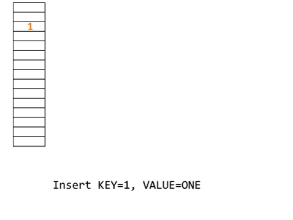
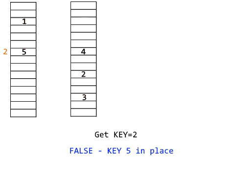
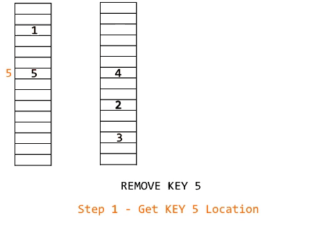

## Chinese Remainder Theorem based HashMap (Layered Hash Table)
A C++11 header for HashMap structure

### Info
A project of mine made some time ago. While tinkering about HashMaps I realized I could do a really simple auto-dynamically-allocating one.

By using the properties of `Chinese Remainder Theorem` we can achieve extremely quick read and writes, as well as keeping the memory allocation low as it can be.

Tested on a ridiculously big number of objects. Could be used to find 1 in 10^9 (1000000000) objects by using only 16GB of space - average search depth is 2.26 reads, maximum search depth is 7 reads - so yeah, really really fast.
It can be set to go even faster (avg 1.4 max 5).

For those that are interested you can read more in the included [PDF file](ShortExplanation.pdf).

### Install
Clone the repo and just `make` . The repo supports MinGW and Linux.

This will only compile the example, but what more do you need.

You can find the executables in `build/crt_hashmap_example` and `build/stdlib_hashmap_example`.

## Benchmark
Check the makefile. You can either compile my version of the HashMap or the stdlib `std::unordered_map<>` .
The Sources are _wrapped_.

By uncommenting-commenting just two lines in the makefile _(yes, it's commented where to do it)_ you can check the code against the stdlib implementation.

Currently, I see this as an absolute win. However, please try using this on different datasets.


### Usage
The namespace used is CRT (as in Chinese Remainder Theorem). You can check sample usage in example.cpp file.
To create an empty HashMap use
```C++
 CRT::HashMap<string, int> hash;   //! string to int mapping
```
This creates an empty HashMap of size 10000 elements, that uses ascending memory allocation.
Should you want to create a bigger default HashMap or set the memory allocation as descending you can use the constructor. I would recommend setting the default HashMap to 0.7*Probable_number_of_your_objects
```C++
 CRT::HashMap<string, float> hash(10000000, true); 
 // Reserves 10 000 000 objects in the memory and sets the dynamic memory allocation to true
 // Key=string , Value=float
```

If you would like to compile with some other template pair include it in the .cpp files for now.

### Future

I've got some changes I need to do. _(benchmarks against stdlib, further optimize speed, simplify usage, improve debug and logging, auto-optimization, ...)_

### Example
To compile the included example
```console
 make
```

### Methods

#### void put(Key, Value)



```C++
 hashmap.put("requested key", Value);
 // maps Value to "requested key", if it fails to do so in this block, it allocates new block of memory for the next block
 // Overwrites the old value if found
```
The method also automatically optimizes the hashmap

#### bool get(key, value)



```C++
 if( hashmap.get("requested key", value) )
 {
	result=value;
	//If this is true then the Value is stored in value (nonreferenced). //Copy constructor on value needed
 }
 else
 {
	//no "requested key" found
 }
```
The method automatically optimizes the hashmap where it can

#### void remove(key)



```C++
 hashmap.remove( "requested key") )
 // removes the "requested key" mapping from memory
```
#### void clear()
```C++
 hashmap.clear()
 //deallocates all blocks and allocates one block of the same size as it started with
```

### Other
Should you use your custom object as value don't forget to assign the correct copy constructor for it.

~~I've commented a few methods I didn't use but you could find useful. HashMap::print_all() prints all elements of the table and the flags on positions. Feel free to uncomment it in 'Block.h' 'and HashMap.h' and use.~~
You can now use the VERBOSE_DEBUG define flag while compiling.

The structure could be easily re-purposed to read from HardDrive instead of RAM should you have even more elements, or even made with multi-thread support to get the best out of the speed and memory allocation.

Or both.